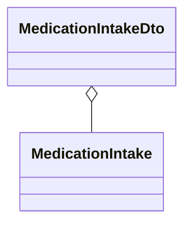
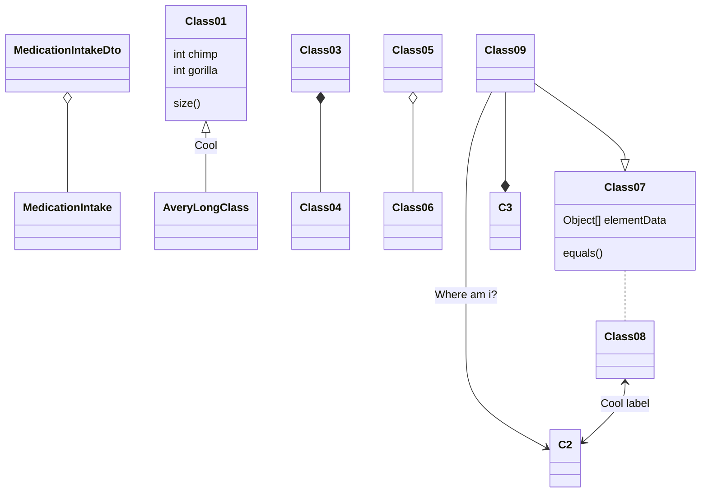

```
               
                                                                                             s                                
                                         :8                                
                           .u    .      .88       x.    .        .u    .   
                  u      .d88B :@8c    :888ooo  .@88k  z88u    .d88B :@8c  
               us888u.  ="8888f8888r -*8888888 ~"8888 ^8888   ="8888f8888r 
            .@88 "8888"   4888>'88"    8888      8888  888R     4888>'88"  
            9888  9888    4888> '      8888      8888  888R     4888> '    
            9888  9888    4888>        8888      8888  888R     4888>      
            9888  9888   .d888L .+    .8888Lu=   8888 ,888B .  .d888L .+   
            9888  9888   ^"8888*"     ^%888*    "8888Y 8888"   ^"8888*"    
            "888*""888"     "Y"         'Y"      `Y"   'YP        "Y"      
             ^Y"   ^Y'                                                     
                                                                           
                                                

```
# 1)  Operations on MedicationIntakes

| Operation                  | description                                 |
|----------------------------|---------------------------------------------|
| GET    /intakes/allIntakes 	 | Retrieve all MedicationIntake from the DB.  |
| GET    /intakes/get/{id}   | Retrieve a MdicationIntake.                 |
| PUT    /intakes/put/{id}   | UPDATE  a MdicationIntake DATA /JSON/       |
| POST   /intakes/add 		     | ADD a new MedicationIntake series via JSON. |
| DELETE /intakes/del/{id}   | DELETE a MdicationIntake by ID.             |

# UML



# (UML markers - training)



       